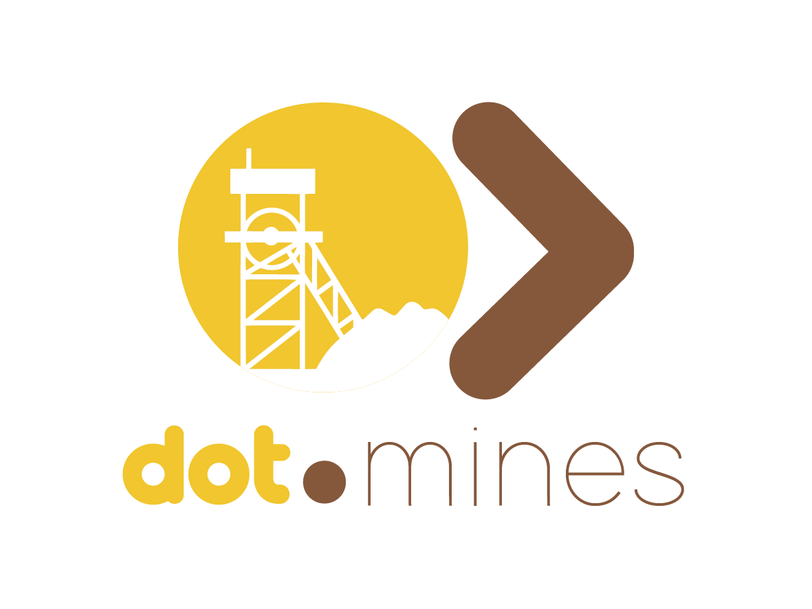

<div align="center">



# Dot.Mines

### Mining Intelligence Platform

**A comprehensive fleet management system for mining operations**


</div>

---

## 📋 Table of Contents

- [Overview](#-overview)
- [Features](#-features)
  - [Fleet Management](#fleet-management)
  - [Live Map & Geofencing](#live-map--geofencing)
  - [AI Analytics & Optimization](#ai-analytics--optimization)
  - [Operations Feed](#operations-feed)
  - [Production Dashboard](#production-dashboard)
  - [Maintenance Management](#maintenance-management)
  - [Fuel Management](#fuel-management)
  - [Route Planning](#route-planning)
  - [IoT Sensor Integration](#iot-sensor-integration)
  - [OEM Integrations](#oem-integrations)
  - [Fleet Market](#fleet-market)
  - [Shift & Team Management](#shift--team-management)
  - [Compliance & Reporting](#compliance--reporting)
  - [Billing & Subscriptions](#billing--subscriptions)
  - [Multi-tenant Architecture](#multi-tenant-architecture)
- [Technology Stack](#-technology-stack)
- [Requirements](#-requirements)
- [Installation](#-installation)
- [Configuration](#️-configuration)
- [Database Setup](#-database-setup)
- [Running the Application](#-running-the-application)
- [Key Features Guide](#-key-features-guide)
- [API Reference](#-api-reference)
- [Project Structure](#-project-structure)
- [Testing](#-testing)
- [Deployment](#-deployment)
- [Troubleshooting](#-troubleshooting)
- [License](#-license)

---

## 🎯 Overview

**Mines** is a modern, production-ready fleet management platform built specifically for mining operations. It combines real-time GPS tracking, AI-powered optimization, structured operational communications, and deep OEM integrations into a single unified platform — replacing fragmented tools like WhatsApp groups and disconnected spreadsheets.

### Key Capabilities at a Glance

| Capability | Description |
|---|---|
| 🗺️ **Live Fleet Tracking** | Real-time GPS machine positions on interactive maps |
| 🤖 **AI Optimization** | Multi-agent AI with anomaly detection and predictive maintenance |
| 📡 **Operations Feed** | Structured real-time comms to replace WhatsApp channels |
| ⛽ **Fuel Management** | Tank management, allocation, forecasting, and budget tracking |
| 🔧 **Maintenance** | Preventive and corrective booking with automated status sync |
| 🏭 **Production Tracking** | Live load comparisons, shift targets, and trend analysis |
| 🔌 **OEM Integrations** | Service layer + credential management for 25 manufacturers — no manufacturer connection has been verified against a real account yet (see [OEM Integrations](#oem-integrations)) |
| 📊 **Reporting** | Compliance, maintenance, production, and incident export to PDF/CSV |
| 💳 **Billing** | Stripe-powered subscriptions with fleet slot enforcement |
| 🔒 **Multi-tenant** | Team-based isolation with granular role and policy access control |

---

## ✨ Features

### Fleet Management

- Live fleet dashboard with all machine statuses at a glance
- Real-time machine location tracking with auto-refresh
- **Cycle time**, **Queue time**, and **Loading time** fields per machine
- Machine health status monitoring and health metrics scoring
- Automatic status update to **Maintenance** when a machine is booked for service
- Subscription-enforced fleet slot limits — prevents over-provisioning
- Machine assignment tracking per mine area

### Live Map & Geofencing

- Interactive live map with two base layers:
  - **Standard** — OpenStreetMap
  - **Satellite** — Esri World Imagery
- Toggle map layers: machines, geofences, route waypoints
- Click machine markers to view detailed machine panels
- Real-time machine position updates with auto-refresh
- **Mine Area Management** — define operational boundaries with exactly 4 coordinate points
  - Visual drawing tool for placing boundary points
  - Real-time preview of boundary as it's drawn
- **Geofence Management** — create virtual perimeters associated with mine areas
  - Entry and exit event tracking per machine
- **Mine Plan Upload** — upload and download mine plan documents

### AI Analytics & Optimization

The AI Optimization Dashboard features a multi-agent architecture with specialist agents:

| Agent | Function |
|---|---|
| **Fleet Optimizer** | Identifies underutilized or overloaded machines |
| **Maintenance Predictor** | Flags machines approaching failure based on health data |
| **Fuel Predictor** | Forecasts consumption and highlights anomalies |
| **Route Advisor** | Suggests optimized routing per section |
| **Cost Analyzer** | Surfaces cost reduction opportunities |
| **Anomaly Detector** | Detects unusual machine behaviour in real time |

- Accept or dismiss AI recommendations — accepted actions are logged
- AI insights and learning data accumulated over time
- Predictive maintenance alerts based on machine health trends
- Fuel consumption forecasting with cost analysis

### Operations Feed

A structured, real-time activity stream that replaces WhatsApp channels for mine operations:

**Post Categories:**

| Category | Description | Auto-behaviour |
|---|---|---|
| `breakdown` | Machine failures | Requires machine ID, failure type, estimated downtime |
| `shift_update` | Shift handover notes | Requires section, shift, loads per hour |
| `safety_alert` | Safety incidents | Auto-set to **critical** priority; pinned to top of feed |
| `production` | Production data | Log production metrics per shift |
| `general` | Free-form updates | No required fields |

**Interaction & Workflow:**
- Real-time broadcast to all users in your mine/section via WebSockets
- **Acknowledgement tracking** per post — see who has read it
- **Like/unlike** posts with optimistic UI updates
- **Nested comments** with @mention support and edit window
- **Approval workflow** — supervisors and managers can approve or reject posts with reasons
- **Admin controls** — pin, delete, and full audit log
- **Shift templates** for quick breakdown and shift-update post creation
- **Push notifications** and **email digests** per shift
- Filter bar: filter by category, section, shift, date range, approval status
- WhatsApp migration tooling with onboarding invites for existing teams

### Production Dashboard

- Side-by-side comparison of **recorded loads** vs **reported loads**
- Interactive charts (bar and line) with tooltips, zoom, and filtering
- Shift-level and section-level **production targets** and actuals
- Week-on-week and month-on-month trend analysis
- Filter by machine, section, shift, or date range
- **Production forecasting** via AI integration
- Export production data to CSV

### Maintenance Management

- Book **preventive** and **corrective** maintenance with 10 maintenance type options
- Priority levels: `low`, `medium`, `high`, `critical`
- Maintenance scheduling with:
  - Estimated duration and cost estimates
  - Required parts list
  - Technician notes
- **Machine status auto-sync** — machine status changes to `Maintenance` on booking
- **Maintenance health service** — automated alert generation based on health trends
- **Component replacement tracking** per machine
- Maintenance calendar and history per machine

### Fuel Management

- **Tank management** — create and manage fuel tanks per mine area with capacity limits
- **Fuel allocation** — allocate fuel to mine areas and track transactions
- **Consumption metrics** — track usage per machine, section, and time period
- **Monthly fuel budgets** with configurable alert thresholds
- **Fuel consumption forecasting** via AI
- Fuel transaction ledger with full audit trail
- Monthly allocation and budget vs actual comparisons

### Route Planning

- Create named routes with **sequenced waypoints**
- Waypoints displayed on the live map in order (start to finish)
- **Traffic Management Plans** — manage TMP documents per route and directly from the map
- Edit and reorder waypoints interactively

### IoT Sensor Integration

- Connect and register IoT sensors per machine
- Real-time sensor readings with configurable polling intervals
- Anomaly detection on sensor data streams
- Historical readings with charting and export
- Alert thresholds per sensor channel

### OEM Integrations

A service class exists per manufacturer (25 total) with a common `BaseManufacturerService` base, credential storage, and an Integration Manager UI — but **no manufacturer connection has ever been verified against a real account**. This section previously described these as "Native API integrations... via their telemetry APIs" with "webhook-based real-time telemetry ingestion"; neither claim was accurate. There is no telemetry webhook receiver in this codebase at all — the only webhook endpoint that exists handles inbound Stripe billing events. Every manufacturer sync is poll-based (a scheduled job calls the manufacturer's REST API on an interval), not push-based.

**Bell** is implemented against Bell Equipment's own published ISO 15143-3 (AEMP 2.0) API spec and Postman collection — real OAuth2 token exchange, real endpoint paths, XML parsing, and 12 unit/integration tests — but has not yet completed a live sync against a real account (see [wiki.md §5.1](wiki.md)).

16 other manufacturers have a service class that attempts real HTTP calls to endpoints inferred from public docs, but **those endpoint shapes have not been confirmed against a real account** — treat them as unverified until a real credential set is tested end-to-end:

Caterpillar, Komatsu, Volvo, Epiroc, Liebherr, Hitachi, Hyundai, Doosan, JCB, Sany, XCMG, Kobelco, Kubota, Roundebult, Kawasaki, CTrack

8 are honestly marked "coming soon" in the app (their `testConnection()` reports unavailability rather than faking success):

John Deere, CASE, New Holland, Takeuchi, Bobcat, Yanmar, Atlas Copco, Sandvik

- Poll-based sync via scheduled jobs (`SyncIntegrationMachinesJob`, `SyncMachineMetricsJob`)
- Credentials stored per-team, never exposed in API responses
- Extensible base manufacturer service for adding new integrations
- Integration Manager in application settings

### Fleet Market

- Fleet brands can list equipment for sale to mines
- Mines can browse and filter listings by type, manufacturer, and condition
- Contact sellers directly through the platform
- Subscription-gated listing creation

### Shift & Team Management

- **Configurable shift templates** per mine: A / B / C shifts
- Automated shift notifications and email digests
- **Operator fatigue tracking** per operator
- Role-based access control:

| Role | Access |
|---|---|
| **Operator** | Own section data, submit feed posts |
| **Supervisor** | Full mine view, approve/reject feed posts |
| **Safety Officer** | Safety alerts, compliance reports |
| **Manager** | All mine data, approve/reject, billing |
| **Admin** | All mines, admin controls, audit logs |

### Compliance & Reporting

- **Compliance violation tracking** — log and categorize violations
- **Incident report events** — surface on Alerts and Reports pages
- **Compliance reports** — filter, view, and export
- **Generate reports** in PDF or CSV:
  - Operational reports
  - Production reports
  - Maintenance reports
  - Fuel reports
  - Compliance reports
- Sentry integration for error monitoring and alerting

### Billing & Subscriptions

- **Stripe-powered** subscription plans and invoicing
- Fleet slot enforcement at machine addition — blocks over-limit additions
- **Billing portal** for self-service subscription management
- Invoice history and payment records
- Subscription plan management with feature gating

### Multi-tenant Architecture

- **Team-based isolation** — each mine operates as an isolated team
- Role and policy-level data access control throughout
- Team switching for users belonging to multiple mines
- Team invitations with email-based onboarding

---

## 🛠 Technology Stack

| Layer | Technology |
|---|---|
| **Backend** | PHP 8.2+, Laravel 12.x |
| **Frontend** | Livewire 3.x, Alpine.js 3.x |
| **Database** | PostgreSQL 16+ |
| **Styling** | Tailwind CSS 3.x, DaisyUI 5.x |
| **Charts** | ApexCharts 5.x, Chart.js 4.x |
| **Maps** | Leaflet 1.9.x, Leaflet Draw, Esri/OSM providers |
| **Real-time** | Laravel Reverb (WebSockets), Laravel Echo, Pusher.js |
| **Queue** | Laravel Queue (database driver) |
| **Auth** | Laravel Jetstream + Sanctum |
| **Payments** | Stripe (via Laravel Cashier) |
| **File Storage** | AWS S3 (via Flysystem) |
| **Search** | Laravel Scout |
| **Error Monitoring** | Sentry |
| **Build Tool** | Vite 7.x |
| **Static Analysis** | PHPStan, Psalm |
| **Testing** | PHPUnit 11 |

---

## 📦 Requirements

- **PHP** 8.2 or higher
- **Composer** 2.x
- **Node.js** 18+ and npm
- **PostgreSQL** 16+
- **Git**

**Optional (for full feature set):**
- Redis (for caching and queues in production)
- AWS S3 bucket (for file/mine plan storage)
- Stripe account (for billing features)
- Sentry DSN (for error monitoring)

---

## 🚀 Installation

### Quick Setup

Use the built-in composer setup script to get running in one command:

```bash
composer run setup
```

This runs: `composer install`, `.env` setup, `key:generate`, `migrate`, `npm install`, and `npm run build`.

### Manual Setup

#### 1. Clone the Repository

```bash
git clone https://github.com/sakhileb/mines.git
cd mines
```

#### 2. Install PHP Dependencies

```bash
composer install
```

#### 3. Install Node Dependencies

```bash
npm install
```

#### 4. Environment Configuration

```bash
cp .env.example .env
```

Edit `.env` with your configuration:

```env
APP_NAME=Mines
APP_ENV=local
APP_KEY=
APP_DEBUG=true
APP_URL=http://localhost

DB_CONNECTION=pgsql
DB_HOST=127.0.0.1
DB_PORT=5432
DB_DATABASE=mines
DB_USERNAME=your_username
# Do NOT store secrets in this file.
# Set DB_PASSWORD via your environment or a secrets manager.

SESSION_DRIVER=database
SESSION_LIFETIME=120
SESSION_ENCRYPT=false

CACHE_DRIVER=file
QUEUE_CONNECTION=database

# Real-time (Laravel Reverb)
REVERB_APP_ID=
REVERB_APP_KEY=
REVERB_APP_SECRET=
REVERB_HOST=localhost
REVERB_PORT=8080

# File Storage (AWS S3)
AWS_ACCESS_KEY_ID=
AWS_SECRET_ACCESS_KEY=
AWS_DEFAULT_REGION=us-east-1
AWS_BUCKET=

# Stripe
STRIPE_KEY=
STRIPE_SECRET=

# Sentry
SENTRY_LARAVEL_DSN=
```

#### 5. Generate Application Key

```bash
php artisan key:generate
```
- Fuel allocation, transactions, and consumption metrics
- Monthly fuel budgets and alert thresholds
- Fuel consumption forecasting via AI

### OEM Integrations
- Native API integrations for 20+ manufacturers: Caterpillar, Komatsu, Volvo, Sandvik, Epiroc, Liebherr, Hitachi, Hyundai, John Deere, Doosan, JCB, Bobcat, Kawasaki, Kobelco, Yanmar, Kubota, XCMG, CASE, New Holland, Atlas Copco, Bell, Sany, Takeuchi, Roundebult, and CTrack
- Webhook-based real-time telemetry ingestion
- Extensible base manufacturer service for adding new integrations

### Fleet Market
- Fleet brands can list equipment for sale to mines
- Subscription-gated listing access

### Shift & Team Management
- Configurable shift templates per mine (A/B/C)
- Operator fatigue tracking
- Role-based access: operators, supervisors, safety officers, managers, admins

### Billing
- Stripe-powered subscription plans and invoicing
- Fleet slot enforcement at machine addition
- Billing portal for self-service subscription management

```

### 2. Install PHP Dependencies

```bash
composer install
```

### 3. Install Node Dependencies

```bash
npm install
```

### 4. Environment Configuration

```bash
cp .env.example .env
```

Edit `.env` file with your configuration:

```env
APP_NAME=Mines
APP_ENV=local
APP_KEY=
APP_DEBUG=true
APP_URL=http://localhost

DB_CONNECTION=pgsql
DB_HOST=127.0.0.1
DB_PORT=5432
DB_DATABASE=mines
DB_USERNAME=your_username
# Do NOT store secrets in this file. Set the password via your environment or secrets manager.
# Example: set `DB_PASSWORD` in your host/CI environment or use a secrets manager integration.
# DB_PASSWORD will be read from the environment at runtime; do not commit real values.

SESSION_DRIVER=database
SESSION_LIFETIME=120
SESSION_ENCRYPT=false

CACHE_DRIVER=file
QUEUE_CONNECTION=sync
```

### 5. Generate Application Key

```bash
php artisan key:generate
```

## 💾 Database Setup

### 1. Create PostgreSQL Database

```bash
createdb mines
```

Or via PostgreSQL:

```sql
CREATE DATABASE mines;
```

### 2. Run Migrations

```bash
php artisan migrate
```

### 3. Seed Database (Optional)

```bash
php artisan db:seed
```

## 🏃 Running the Application

### Development Mode (All-in-One)

```bash
composer run dev
```

This starts the Laravel server, queue listener, log viewer, and Vite dev server concurrently.

Or start services individually:

```bash
# Laravel server
php artisan serve

# Vite dev server (separate terminal)
npm run dev

# Queue worker (separate terminal)
php artisan queue:listen --tries=1

# WebSocket server (separate terminal)
php artisan reverb:start
```

Access the application at: `http://localhost:8000`

### Production Build

```bash
npm run build
```

---

## 📚 Key Features Guide

### Live Map

Navigate to the **Live Map** to view real-time fleet locations:

- **Toggle Layers**: Show/hide machines, geofences, and route waypoints
- **Map Styles**: Switch between Standard (OpenStreetMap) and Satellite (Esri World Imagery)
- **Machine Details**: Click on machine markers for detailed information
- **Route Waypoints**: Click the Routes button to display sequenced waypoints start to finish
- **Traffic Management Plan**: Manage traffic plans directly from the map
- **Auto-refresh**: Map updates automatically with latest data

### Mine Area Management

1. Navigate to **Mine Areas**
2. Click "Create New Mine Area"
3. Enter mine area name
4. Enter exactly 4 coordinate points (latitude, longitude)
5. Use the drawing tool to visually place points on the map
6. Preview shows your boundary in real-time
7. Submit to save

**Drawing Mode Features**:
- Hover to preview marker placement
- Click to add points with visual feedback
- Points automatically connect to form boundary

### Geofence Management

1. Navigate to **Geofences**
2. Click "Create New Geofence"
3. Select the mine area for this geofence
4. Enter geofence name and add coordinate points
5. Submit to save — entry/exit events are tracked automatically

### Maintenance Booking

1. Navigate to **Maintenance Dashboard**
2. Click "Book Maintenance"
3. Select machine, maintenance type, and priority level
4. Set scheduled date, estimated duration, cost estimate, and required parts
5. Add technician notes if needed
6. Submit — machine status updates to **Maintenance** automatically

### Fuel Management

1. Navigate to **Fuel Management**
2. Select a mine area and view its tanks
3. Click "Create New Tank" to add a tank with name and capacity
4. Track fuel allocation, transactions, and consumption metrics
5. Set monthly budgets and configure alert thresholds

### Operations Feed

1. Navigate to **Feed**
2. Click "New Post" and select a category:
   - **Breakdown** — machine ID, failure type, estimated downtime required
   - **Shift Update** — section, shift, loads per hour required
   - **Safety Alert** — auto-set critical and pinned to top
   - **Production** — log production data per shift
   - **General** — free-form operational updates
3. Attach photos or files (optional)
4. Post broadcasts to all users in real time
5. Acknowledge, like, comment, or use the approval workflow
6. Filter by category, section, shift, date, or approval status

### AI Analytics & Optimization

1. Navigate to **AI Optimization Dashboard**
2. Review recommendations from specialist agents (Fleet Optimizer, Maintenance Predictor, Fuel Predictor, Route Advisor, Cost Analyzer, Anomaly Detector)
3. Accept or dismiss recommendations — accepted actions are logged
4. Monitor AI insights and learning data over time

### Production Dashboard

1. Navigate to **Production**
2. View recorded loads vs reported loads side by side
3. Use interactive charts with tooltips, zoom, and filtering
4. Filter by machine, section, shift, or date range
5. Compare actuals against targets; track week-on-week and month-on-month trends

### Fleet Market

1. Navigate to **Fleet Market**
2. Browse equipment listings from OEM brands and other mines
3. Contact sellers directly through the platform
4. List your own equipment (subject to subscription tier)

### Route Planning

1. Navigate to **Route Planning**
2. Create a route and add sequenced waypoints
3. View waypoints on the live map in order (start to finish)
4. Manage Traffic Management Plans per route

---

## 🔌 API Reference

### Authentication

The API uses [Laravel Sanctum](https://laravel.com/docs/sanctum) token authentication.

```bash
Authorization: Bearer <your-api-token>
```

Generate a token from your user profile settings.

### Endpoints

```bash
# Fleet
GET    /api/machines
GET    /api/machines/{id}
POST   /api/machines/{id}/assignments

# Mine Areas & Geofences
GET    /api/mine-areas
GET    /api/geofences
POST   /api/geofences

# Maintenance
GET    /api/maintenance-records
GET    /api/maintenance-schedules

# Fuel
GET    /api/fuel-tanks
GET    /api/fuel-transactions
POST   /api/fuel-transactions

# Operations Feed
GET    /api/feed
POST   /api/feed
DELETE /api/feed/{id}
POST   /api/feed/{id}/acknowledge
GET    /api/feed/{id}/acknowledgements
POST   /api/feed/{id}/comments
PUT    /api/feed/comments/{comment_id}
DELETE /api/feed/comments/{comment_id}
GET    /api/feed/{id}/comments
POST   /api/feed/{id}/like
GET    /api/feed/{id}/likes
POST   /api/feed/{id}/approve
POST   /api/feed/{id}/reject
POST   /api/feed/{id}/attachments

# Production
GET    /api/production-records
GET    /api/production-targets

# Alerts & Compliance
GET    /api/alerts
GET    /api/compliance-reports
GET    /api/compliance-violations

# Shifts
GET    /api/shift-templates

# IoT Sensors
GET    /api/iot-sensors
GET    /api/iot-sensors/{id}/readings

# Reports
GET    /api/reports

# Routes & Waypoints
GET    /api/routes
GET    /api/routes/{id}/waypoints
```

---

## 📁 Project Structure

```
mines/
├── app/
│   ├── Actions/              # Jetstream/Fortify action classes
│   ├── Console/              # Artisan commands
│   ├── Contracts/            # Interfaces and contracts
│   ├── Events/               # Event classes
│   ├── Http/
│   │   ├── Controllers/      # API and web controllers
│   │   └── Middleware/       # HTTP middleware
│   ├── Jobs/                 # Queued jobs
│   ├── Listeners/            # Event listeners
│   ├── Livewire/             # Livewire full-page and inline components
│   ├── Models/               # Eloquent models (60+ models)
│   ├── Policies/             # Authorization policies
│   ├── Services/
│   │   ├── AI/               # AI optimization agents
│   │   └── Integration/      # OEM manufacturer API services
│   └── Traits/               # Shared model/controller traits
├── config/                   # App configuration (integrations, scanning, etc.)
├── database/
│   ├── migrations/           # Database schema migrations
│   ├── factories/            # Model factories for testing
│   └── seeders/              # Database seeders
├── deploy/                   # Deployment configs (queue worker, S3 policies)
├── public/                   # Document root (Vite build output, assets)
├── resources/
│   ├── css/                  # Tailwind CSS entry points
│   ├── js/                   # Alpine.js, chart, and map scripts
│   ├── markdown/             # Markdown content files
│   └── views/                # Blade templates
├── routes/
│   ├── web.php               # Web routes
│   ├── api.php               # API routes
│   ├── channels.php          # Broadcast channel definitions
│   └── console.php           # Console/scheduled command routes
├── scripts/                  # DevOps and maintenance shell scripts
├── security/                 # Security audit notes and reports
├── storage/                  # Logs, cache, uploaded files, reports
├── tests/
│   ├── Feature/              # Feature/integration tests
│   └── Unit/                 # Unit tests
└── vendor/                   # Composer dependencies
```

---

## 🧪 Testing

Run the full test suite:

```bash
composer run test
# or
php artisan test
```

Run a specific test file:

```bash
php artisan test tests/Feature/MachineTest.php
```

Run with code coverage:

```bash
php artisan test --coverage
```

Run static analysis:

```bash
# PHPStan
vendor/bin/phpstan analyse

# Psalm
vendor/bin/psalm
```

---

## 🚢 Deployment

### Production Checklist

1. **Set environment**
   ```bash
   APP_ENV=production
   APP_DEBUG=false
   ```

2. **Install dependencies (no dev)**
   ```bash
   composer install --optimize-autoloader --no-dev
   npm ci
   ```

3. **Build frontend assets**
   ```bash
   npm run build
   ```

4. **Cache configuration**
   ```bash
   php artisan config:cache
   php artisan route:cache
   php artisan view:cache
   php artisan event:cache
   ```

5. **Run migrations**
   ```bash
   php artisan migrate --force
   ```

6. **Set storage permissions**
   ```bash
   chmod -R 775 storage bootstrap/cache
   chown -R www-data:www-data storage bootstrap/cache
   ```

7. **Start queue worker** (use `deploy/queue-worker.service` for systemd or `deploy/queue-worker.supervisord.conf` for Supervisor). Requires `QUEUE_CONNECTION=redis`, matching `.env.production.example`.
   ```bash
   php artisan queue:work redis --tries=3 --timeout=90
   ```

8. **Start the Reverb WebSocket server** (use `deploy/reverb.service` for systemd or `deploy/reverb.supervisord.conf` for Supervisor) -- never run this as a bare foreground command in production, it needs the same process supervision as the queue worker.
   ```bash
   php artisan reverb:start
   ```
   Binds to `REVERB_SERVER_HOST`/`REVERB_SERVER_PORT` (loopback-only by default in `.env.production.example`) -- it is not meant to be reachable directly from the internet. See "WebSocket Reverse Proxy" below for how browsers actually reach it over `wss://`.

### Web Server Configuration

#### Nginx

```nginx
server {
    listen 80;
    server_name your-domain.com;
    return 301 https://$host$request_uri;
}

server {
    listen 443 ssl;
    http2 on;
    server_name your-domain.com;
    root /var/www/mines/public;

    ssl_certificate     /etc/letsencrypt/live/your-domain.com/fullchain.pem;
    ssl_certificate_key /etc/letsencrypt/live/your-domain.com/privkey.pem;

    add_header X-Frame-Options "SAMEORIGIN";
    add_header X-Content-Type-Options "nosniff";

    index index.php;
    charset utf-8;

    location / {
        try_files $uri $uri/ /index.php?$query_string;
    }

    location = /favicon.ico { access_log off; log_not_found off; }
    location = /robots.txt  { access_log off; log_not_found off; }

    error_page 404 /index.php;

    location ~ \.php$ {
        fastcgi_pass unix:/var/run/php/php8.2-fpm.sock;
        fastcgi_param SCRIPT_FILENAME $realpath_root$fastcgi_script_name;
        include fastcgi_params;
    }

    location ~ /\.(?!well-known).* {
        deny all;
    }

    # Only Reverb's client-facing path (/app/{key}, what Echo/pusher-js
    # connects to) is proxied here. Its server-to-server publish API
    # (/apps/{id}/events etc.) is deliberately NOT exposed publicly --
    # config/broadcasting.php's reverb connection talks to it directly over
    # the internal REVERB_SERVER_HOST/PORT instead, so it never needs to be
    # reachable from outside this box.

    # WebSocket Reverse Proxy -- proxies wss://your-domain.com/app/... to the
    # internal reverb:start process (REVERB_SERVER_HOST/PORT, loopback-only
    # by default). The Upgrade/Connection headers are what turn this from a
    # plain HTTP proxy into a WebSocket one; without them the client's
    # protocol upgrade handshake fails and Echo falls back to polling or
    # errors outright. Long read_timeout because these are meant to be
    # long-lived connections, not request/response.
    location /app {
        proxy_pass http://127.0.0.1:8080;
        proxy_http_version 1.1;
        proxy_set_header Upgrade $http_upgrade;
        proxy_set_header Connection "upgrade";
        proxy_set_header Host $host;
        proxy_set_header X-Real-IP $remote_addr;
        proxy_set_header X-Forwarded-For $proxy_add_x_forwarded_for;
        proxy_set_header X-Forwarded-Proto $scheme;
        proxy_read_timeout 60s;
    }
}
```

#### Apache

Requires `mod_proxy`, `mod_proxy_wstunnel`, and `mod_ssl` enabled (`a2enmod proxy proxy_wstunnel ssl`).

```apache
<VirtualHost *:80>
    ServerName your-domain.com
    Redirect permanent / https://your-domain.com/
</VirtualHost>

<VirtualHost *:443>
    ServerName your-domain.com
    DocumentRoot /var/www/mines/public

    SSLEngine on
    SSLCertificateFile      /etc/letsencrypt/live/your-domain.com/fullchain.pem
    SSLCertificateKeyFile   /etc/letsencrypt/live/your-domain.com/privkey.pem

    <Directory /var/www/mines/public>
        AllowOverride All
        Require all granted
    </Directory>

    # WebSocket Reverse Proxy -- see the Nginx /app block above for what
    # this achieves and why. ProxyPass's own ws:// scheme (rather than
    # http://) is what makes mod_proxy_wstunnel handle the Upgrade
    # handshake instead of treating this as a normal HTTP proxy.
    ProxyPass        /app ws://127.0.0.1:8080/app
    ProxyPassReverse /app ws://127.0.0.1:8080/app
</VirtualHost>
```

---

## 🔧 Troubleshooting

### Map Not Loading

- Check internet connectivity (CDN access required for tile layers)
- Check browser console for JavaScript errors
- Clear browser cache

### Session Expired / Frequent Logouts

```bash
php artisan config:clear
php artisan cache:clear
# Ensure SESSION_DRIVER=database in .env
```

### CSRF Token Mismatch (419)

```bash
php artisan cache:clear
php artisan config:clear
# Verify cookies are enabled in the browser
```

### Database Connection Failed

```bash
# Check PostgreSQL is running
sudo systemctl status postgresql

# Test from artisan
php artisan tinker
> DB::connection()->getPdo();
```

### Storage / Permission Denied

```bash
chmod -R 775 storage bootstrap/cache
chown -R www-data:www-data storage bootstrap/cache
```

### Livewire Component Not Updating

```bash
php artisan livewire:discover
php artisan view:clear
php artisan config:clear
```

### Assets Not Loading in Production (404)

```bash
npm run build
# Verify public/build/ exists and vite manifest is present
```

### Getting More Help

- Check application logs: `storage/logs/laravel.log`
- Enable debug mode temporarily: `APP_DEBUG=true`
- [Laravel Documentation](https://laravel.com/docs)
- [Livewire Documentation](https://livewire.laravel.com/docs)
- [Laravel Reverb Documentation](https://reverb.laravel.com)

---

## 📄 License

This project is proprietary software. All rights reserved.

---

<div align="center">

**Mines** — Mining Intelligence Platform

Built for Mining Operations

**Version 3.0** · April 2026

</div>
